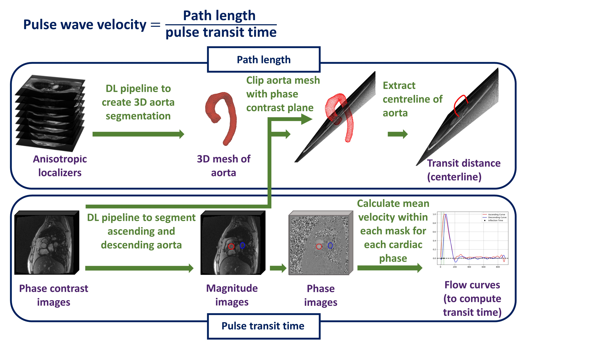
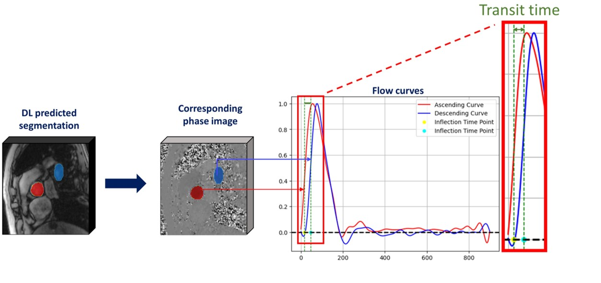

# Automated Pulse Wave Velocity measurement pipeline

Aortic pulse wave velocity (PWV) – the speed that arterial pulse propagates along the aorta – is a non-invasive marker of arterial stiffness and an established independent predictor of cardiovascular disease. Here, we present a fully automated pipeline to estimate PWV from a standard cardiac MR exam without the need for additional or specialized 3D sequences. 

We achieve this by extending our previous work, which uses deep learning (DL) to create high-resolution 3D aortic segmentations from a trans-axial stack of bright-blood localizer images with low through-plane resolution. These 3D segmentations can be used to extract an aortic centerline and calculate the path length (distance along the centerline between ascending and descending aortic flow measurements). Furthermore, we developed DL segmentation of the ascending and descending aorta in the phase contrast flow images, allowing fully automated measurement of pulse transit time. 

In the Aorta segmentation folder, you can find the model creating high-resolution 3D segmentation from localizers, training details of the model is also available at https://github.com/JoyceYJ01/U-Net_LR. Please note that centerline extraction algorithm used the Vascular Modeling Toolkit (VMTK) package , which requires an older version of the VTK mesh (version 42) to function properly.

In the Flow segmentation folder, you can find the model segmenting ascending and descending aorta from the phase contrast images and gives the flow curves. There were more than one established methods of measuring transit time and we provided codes for 1. inflection points (i.e. second derivative) 2. 3. Half-max. The process is shown in the figure below.

Please cite our paper as: Jiang, Yue, Tina Yao, Nikhil Paliwal, Daniel Knight, Karan Punjabi, Jennifer Steeden, Alun D. Hughes, Vivek Muthurangu, and Rhodri Davies. "Fully automated measurement of aortic pulse wave velocity from routine cardiac MRI studies." Magnetic Resonance Imaging (2025): 110442.

